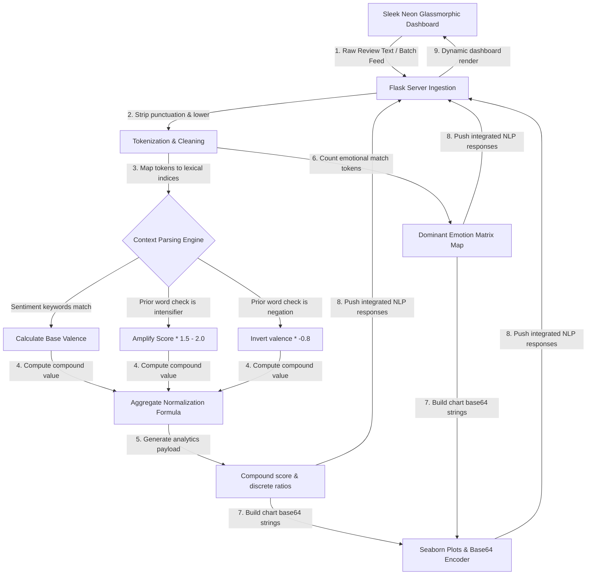

# 🧠 NovaSentiment | NLP Sentiment Intelligence Studio

NovaSentiment is a premium, high-performance Natural Language Processing (NLP) and sentiment intelligence dashboard. Built with a context-aware, rule-based lexical parsing engine in pure Python, it features a zero-dependency architecture that runs seamlessly in restricted environments. NovaSentiment performs custom tokenization, handles intensifiers (which multiply valence weights) and negations (which invert polarity) inside lookback windows, maps dominant emotions (Joy, Anger, Sadness, Fear, Surprise), and compiles strategic business recommendation logs.

### 🛠️ Built With & Tech Stack


---

## 📐 System Architecture & Data Flow

Because raw text is highly context-sensitive, NovaSentiment parses intensifiers (which multiply scores) and negations (which invert scores) in a 2-word lookback window:



### 🔹 Unicode Architecture Pipeline Map
```text
┌────────────────────────────────────────────────────────────────────────────┐
│                       NOVASENTIMENT WORKSPACE PIPELINE                     │
└────────────────────────────────────────────────────────────────────────────┘
  [ Text Sandbox Panel ] ───(1. Raw Review / Batch Feed API)──► [ Flask NLP ]
           ▲                                                        │
           │                                                        │
           │                                                (2. Tokenizer &
           │                                                Negations Lookback)
           │                                                        │
           ▼                                                        ▼
  [ Glassmorphic Visuals ] ◄───(4. Base64 Figures JSON)─── [ Emotion Lexicon ]
  ├─ Glowing Polarity Gauge                               (Joy, Anger, Sadness,
  ├─ Emotion Radar Matrices                                Fear, Surprise maps)
  ├─ Token Highlighters
  └─ Strategic Business Actions
```

---

## ⚡ Core Features & Portfolio Highlights

1. **Custom Rule-Based NLP Classifier Engine**:
   * Operates with **zero external nltk file dependencies**—guaranteeing 100% reliable execution in restricted corporate environments.
   * Curated valence dictionaries covering product reviews, social interactions, and macro financial headlines.
   * **Intensifier detection**: Multiplies adjacent scores when adverbs like "very", "extremely", "incredibly", or "absolutely" are detected.
   * **Negation handling**: Flips polarities cleanly when words like "not", "never", "don't", or "cannot" are mapped in a lookback window.

2. **Emotion Profiling Engine**:
   * Evaluates text token frequencies against a five-dimensional lexical index: **Joy, Anger, Sadness, Fear, and Surprise**.
   * Identifies the exact dominant emotion and highlights positive vs. negative matching tokens inside the interactive interface.

3. **Multi-Feed Ingestor Sandbox**:
   * Instantly ingest pre-designed real-world feed datasets to showcase practical business applications:
     * **Amazon Product Reviews**: Tracks user sentiment on hardware specifications and service quality.
     * **Social Media comments**: Tracks immediate public PR reactions on airline delays or sudden gift surprises.
     * **Corporate News Headlines**: Audits macro market sentiment and financial volatility threats.

4. **Strategic Recommendation Logger**:
   * Generates direct business insights:
     * High negative sentiment prompts PR crisis alerts.
     * High sadness/disappointment recommends churn-retention recovery discounts.
     * High joy recommends targeted marketing referral campaigns.

---

## 📂 Project Directory Structure

```text
TASK 4 SENTIMENT ANALYSIS/
│
├── app.py                             # Flask NLP routes, negations & intensity multipliers
├── README.md                          # System documentation & installation guide
├── sentiment_walkthrough.md           # Emotional lexicons & valence mapping rules
│
├── templates/
│   └── index.html                     # Interactive Text Sandbox & feed tables
│
└── static/
    ├── css/
    │   └── style.css                  # HSL cyberpunk glassmorphic style
    └── js/
        └── main.js                    # API query scripts, badge highlights, charts loader
```

---

## ⚙️ How to Deploy & Verify Task 4

### Prerequisites
Make sure **Python 3.10+** and `pip` are installed on your system.

### Step 1: Install NLP Dependencies
Open your shell or terminal and run:
```bash
pip install flask flask-cors pandas numpy scipy matplotlib seaborn
```

### Step 2: Start the NLP Web Studio
From your project workspace folder, execute the Flask application:
```bash
python app.py
```
*Note: This server is configured to bind to port **5003** to prevent conflicts with other tasks.*

### Step 3: Run Interactive Tests
Open your web browser and navigate to:
👉 **[http://127.0.0.1:5003](http://127.0.0.1:5003)**

1. **Parser Sandbox**: In the "Text Analyzer" tab, type: *"The camera quality is incredibly stunning! It is absolutely perfect."* and click **Execute Lexical Parser**. The dashboard will instantly display:
   * **Compound Score**: ~`0.85`
   * **Sentiment Class**: `POSITIVE` (in glowing cyan neon)
   * **Dominant Emotion**: `JOY` / `SURPRISE`
   * Highlighted tags showing the exact lexical weights.
2. **Execute Negation Tests**: Type: *"This product is not very good."* and see how the negations window flips the positive valence of "good" into a neat negative score!
3. **Audit Ingested Feeds**: Select the "Batch Feeds Explorer" tab, click **Social Media Comments**, and click **Execute Batch Ingestion** to see custom multi-feed bar charts and pie charts rendered on the fly!
