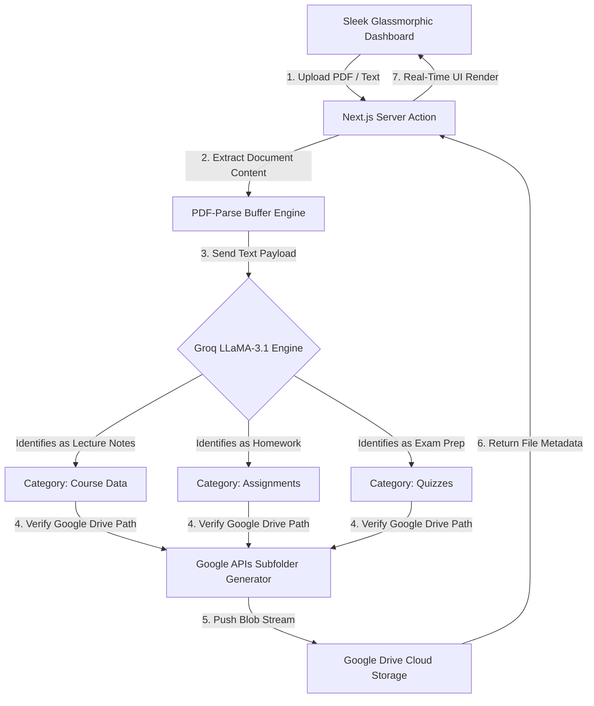

# 🧠 DocMind | AI-Powered Academic Organization Studio

DocMind is a premium, high-performance academic document management dashboard. Built with a modern Next.js 15 App Router architecture, it features a **zero-database infrastructure** that securely routes and stores all files directly inside the user's hidden Google Drive `AppDataFolder`. DocMind utilizes a context-aware AI parsing engine powered by **Groq (LLaMA-3.1-8b)** to automatically read, analyze, and sub-categorize academic files (Course Data, Assignments, Quizzes) instantly upon upload.

### 🛠️ Built With & Tech Stack


---

## 📐 System Architecture & Data Flow

Because academic documents require precise sorting, DocMind uses an ultra-fast LLM pipeline combined with automated Google Drive folder traversal:



### 🔹 Infrastructure Pipeline Map
```text
┌────────────────────────────────────────────────────────────────────────────┐
│                          DocMind WORKSPACE PIPELINE                       │
└────────────────────────────────────────────────────────────────────────────┘
  [ Smart Upload Button ] ───(1. Secure Auth Token)───► [ NextAuth & OAuth ]
           ▲                                                        │
           │                                                        │
           │                                                (2. LLaMA-3.1 AI
           │                                                Content Classifier)
           │                                                        │
           ▼                                                        ▼
  [ Glassmorphic Visuals ] ◄───(4. File Metadata)────── [ Google Drive API ]
  ├─ Semester Navigation                                  (DocMind / Semester
  ├─ Subject Dashboards                                    / Subject / Category)
  ├─ Interactive Breadcrumbs
  └─ PWA Install Prompt
```

---

## ⚡ Core Features & Portfolio Highlights

1. **Zero-Database Google Cloud Architecture**:
   * Operates entirely on the user's **Google Drive AppData**, meaning zero hosting costs for user data.
   * Auto-generates exact nested hierarchies (`DocMind / Semester / Subject / Category`) on the fly.
   * Built-in duplicate detection and strict 10MB payload size validation.

2. **Groq AI Auto-Categorization Engine**:
   * Leverages the lightning-fast `llama-3.1-8b-instant` model to parse the first 2,000 characters of uploaded documents.
   * Automatically infers if a file is a Syllabus (Course Data), an Essay (Assignments), or a Test (Quizzes) without the user having to select a folder manually.

3. **Dynamic Semester & Subject Tracker**:
   * Stateful sidebars and dashboards allowing users to activate specific semesters, isolating subjects and files by academic timeline.
   * Secure NextAuth session management wrapping all API routes.

4. **Midnight & Silver Glassmorphism UI**:
   * Visually stunning dark-mode aesthetic utilizing deep sapphire backgrounds (`#051424`), frosted glass panels, and elegant micro-animations.
   * **PWA Ready**: Installs as a standalone native app on mobile devices via a standard Web App Manifest and SVG masking.

---

## 📂 Project Directory Structure

```text
DocMind-app/
│
├── src/
│   ├── app/                           # Next.js 15 App Router structure
│   │   ├── api/                       # Backend Routes (Uploads, Auth, AI, Semesters)
│   │   ├── dashboard/                 # Protected Glassmorphic UI pages
│   │   ├── login/                     # Google OAuth Landing Page
│   │   ├── layout.tsx                 # Root layout & PWA Metadata
│   │   └── globals.css                # Tailwind definitions & Glass utilities
│   │
│   ├── components/                    # Reusable React Client Components
│   │   ├── Sidebar.tsx                # Semester navigation logic
│   │   ├── SubjectCard.tsx            # AI Smart Upload interactive cards
│   │   └── Providers.tsx              # NextAuth Session wrapper
│   │
│   └── lib/                           # Core Architecture Logic
│       ├── ai-classifier.ts           # Groq SDK parsing & PDF extraction
│       ├── drive-folders.ts           # Google Drive Hierarchy API
│       ├── semesters.ts               # AppData CRUD operations
│       └── subjects.ts                # Subject Data Models
│
└── public/
    ├── manifest.json                  # Progressive Web App configuration
    └── icon.svg                       # PWA Brain Maskable Icon
```

---

## ⚙️ How to Deploy & Verify

### Prerequisites
Make sure **Node.js (v18+)** and `npm` are installed on your system.
You will need active API keys for Google Cloud Console (OAuth) and Groq.

### Step 1: Install Dependencies
Open your terminal inside the project directory and run:
```bash
npm install
```

### Step 2: Configure Environment Variables
Create a file named `.env.local` in the root folder and add your secure keys:
```env
GOOGLE_CLIENT_ID=your_google_oauth_client_id
GOOGLE_CLIENT_SECRET=your_google_oauth_secret
NEXTAUTH_SECRET=a_secure_random_string_for_hashing
NEXTAUTH_URL=http://localhost:3000
GROQ_API_KEY=your_groq_api_key
```

### Step 3: Start the Development Studio
Execute the Next.js development server:
```bash
npm run dev
```

### Step 4: Run Interactive Tests
Open your web browser and navigate to:
👉 **[http://localhost:3000](http://localhost:3000)**

1. **Authentication Sandbox**: Click **Sign in with Google**. Ensure your email is added as a "Test User" in Google Cloud if your app is unverified.
2. **Architecture Generation**: Click the `+` in the sidebar to create a Semester, then click "Add Subject". This writes configurations instantly to your hidden Google Drive AppData.
3. **Execute AI Smart Uploads**: On any Subject Card, click **🤖 Smart Upload** and select a PDF or text file. Watch the real-time notification as Groq parses the text, classifies the document, and uploads it to the correct Google Drive subfolder simultaneously!
